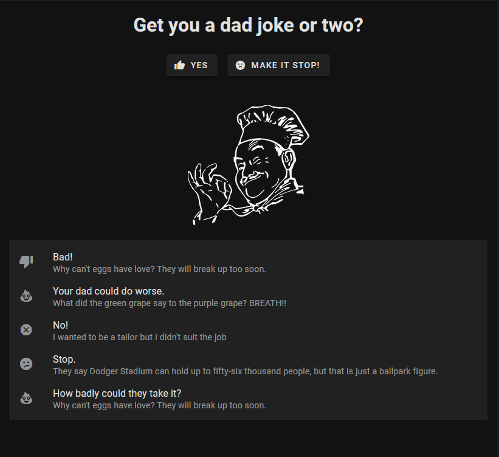

# Dad joke retriever

A merciles front end for unrelenting dad jokes.  I made this so that I could
practice a little bit with new Vue 3 and Vuetify 3 features.



## Project setup

```
npm install
```

### Compiles and hot-reloads for development

```
# npm
npm run dev
```

### Compiles and minifies for production

```
# npm
npm run build
```

### Lints and fixes files

```
# npm
npm run lint
```

### Customize Vite configuration

See [Configuration Reference](https://vitejs.dev/config/).
